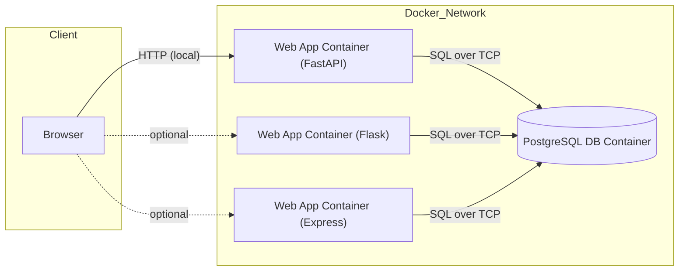
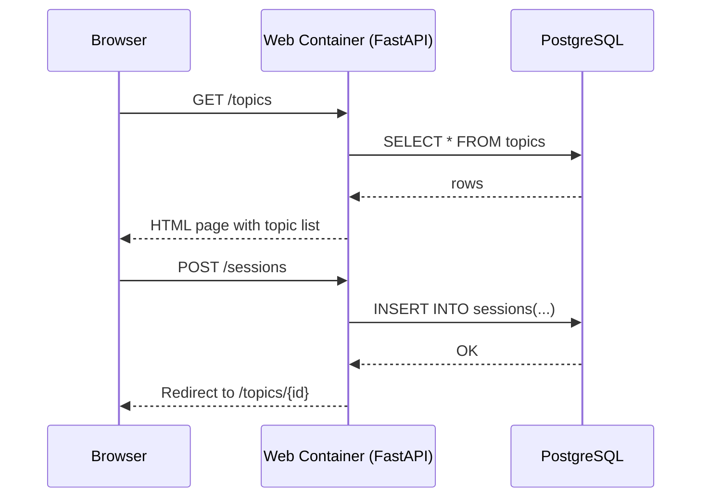
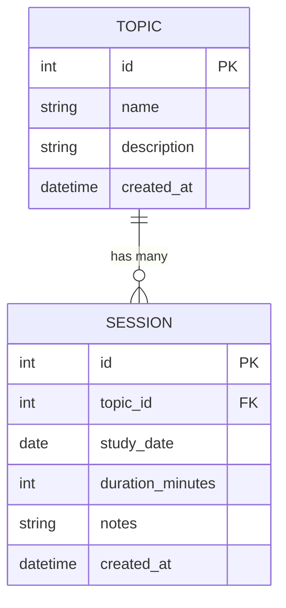

# StudyTracker

[](./LICENSE)
[](https://github.com/Yscottnorton-io/studytracker-docker-learning/commits/main)
[](https://github.com/scottnorton-io/studytracker-docker-learning/issues)
[](#quick-start)
[](#)
[](#)

> A small, production-shaped web app designed to learn Docker, FastAPI, and PostgreSQL end to end. The goal is not feature depth, but clean architecture, containerization, and Titanium 10+–grade code and documentation.

---

## 1. Project overview

### 1.1 Goal

StudyTracker is a minimal but realistic web application that helps you track learning sessions:

- Create **topics** (for example, "Docker", "PostgreSQL")
- Log **sessions** for each topic (date, duration, notes)
- View topics and recent activity in the browser

The focus is on:

- Clear separation of concerns (web, database, infra)
- Docker-first workflows using `docker compose`
- A clean, testable FastAPI backend, plus alternate backends

### 1.2 Tech stack

**Primary backend:**

- Python + FastAPI
- PostgreSQL for persistence
- Docker / Docker Compose for orchestration
- pytest + linters for quality

**Alternate backends (optional, for learning):**

- Flask (Python)
- Express (Node.js)

All backends follow the same API contract so you can swap implementations without changing the overall architecture.

---

## 2. Architecture

This section references diagrams that live alongside the code. Replace the placeholders below with final Mermaid or image exports.

### 2.1 System context


### 2.2 Request lifecycle


### 2.3 Data model


---

## 3. Repository structure
```javascript
studytracker-docker-learning/
├─ src/
│  ├─ app/                 # FastAPI primary backend
│  │  ├─ __init__.py
│  │  ├─ main.py
│  │  ├─ api/
│  │  ├─ models/
│  │  ├─ schemas/
│  │  └─ config/
│  └─ alt_backends/        # Flask / Express implementations
│      ├── flask_app/
│      └── express_app/
├─ tests/
├─ docker/
│  ├─ Dockerfile.web-fastapi
│  ├─ Dockerfile.web-flask
│  └─ Dockerfile.web-express
├─ docker-compose.yml
├─ .env.example
├─ README.md
├─ LICENSE
├─ CONTRIBUTING.md
├─ CODE_OF_CONDUCT.md
├─ SECURITY.md
└─ .github/
   ├─ ISSUE_TEMPLATE/
   │  ├─ bug_report.md
   │  └─ feature_request.md
   └─ pull_request_template.md
```

---

## 4. Getting started

### 4.1 Prerequisites

- Docker and Docker Compose installed
- Python (for local tooling, optional if you only use Docker)

### 4.2 Quick start (FastAPI + Postgres)
```bash
cp .env.example .env

# build and run FastAPI + Postgres

docker compose up --build web-fastapi db
```

Then open:

- App: http://localhost:8000/
- Health check: http://localhost:8000/healthz

Run tests:
```bash
docker compose run --rm web-fastapi pytest
```

---

## 5. Learning pathway

Use tags to mark learning milestones:

- v0.1.0 – Bare FastAPI app (no Docker)
- v0.2.0 – Dockerized FastAPI only
- v0.3.0 – docker-compose with Postgres
- v0.4.0 – Plug-and-play alternate backends
- v0.5.0 – Titanium 10+ hardening

Each tag should have a short note summarizing what changed and what new learning surface it introduces.

---

## 6. Titanium 10+ code of excellence

This repository is intended as a Titanium 10+ example:

- **Clarity and purpose** – documented goals and diagrams that match reality
- **Code organization** – clear separation of routes, models, schemas, config
- **Security hygiene (learning level)** – no secrets committed, `.env` + `.env.example` used
- **Quality and testing** – real tests for key routes and models, linters configured
- **Operational readiness** – `docker compose up --build` as the main entrypoint, `/healthz` implemented

---

## 7. Contributing, conduct, and security

- Contributing guide: see `CONTRIBUTING.md`
- Code of Conduct: see `CODE_OF_CONDUCT.md`
- Security policy: see `SECURITY.md`
- License: see `LICENSE`

>Note that the repo is a learning artifact; contributions must improve clarity, safety, or teaching value.
