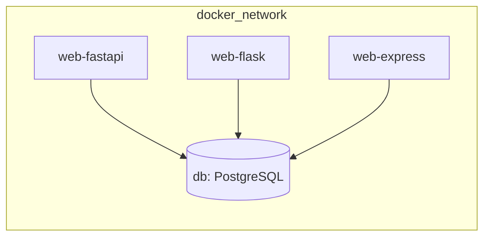

# 📁 Docker & Compose Layout

## Docker & Compose layout

### 1. Services

We model four main services in `docker-compose.yml`:

- `web-fastapi` – primary backend, mounts `src/app`.
- `web-flask` – alternate Python backend, shares DB schema.
- `web-express` – alternate Node/Express backend.
- `db` – PostgreSQL database.

Only **one** web service runs at a time during normal learning sessions.

### 2. Network and volumes (conceptual)



- All services share the default compose network.
- Web containers connect to the DB using host `db` and port `5432`.
- A named volume (for example, `db_data`) persists database state between runs.

### 3. Compose skeleton (structure only)

```yaml
version: "3.9"

services:
  web-fastapi:
    build:
      context: .
      dockerfile: docker/web.fastapi.Dockerfile
    env_file:
      - .env
    depends_on:
      - db

  web-flask:
    build:
      context: .
      dockerfile: docker/web.flask.Dockerfile
    env_file:
      - .env
    depends_on:
      - db

  web-express:
    build:
      context: .
      dockerfile: docker/[web.express](http://web.express).Dockerfile
    env_file:
      - .env
    depends_on:
      - db

  db:
    image: postgres:16-alpine
    environment:
      POSTGRES_DB: studytracker
      POSTGRES_USER: studyuser
      POSTGRES_PASSWORD: studypass
    volumes:
      - db_data:/var/lib/postgresql/data

volumes:
  db_data:
```

### 4. Running the stack (learning mode)

- **Bring everything up** (FastAPI + Postgres):
    - `docker compose up --build web-fastapi db`
- **Switch to Flask:**
    - `docker compose up --build web-flask db`
- **Switch to Express:**
    - `docker compose up --build web-express db`

In each case, the app should be reachable at [`http://localhost:8000/`](http://localhost:8000/) once the web container is healthy.