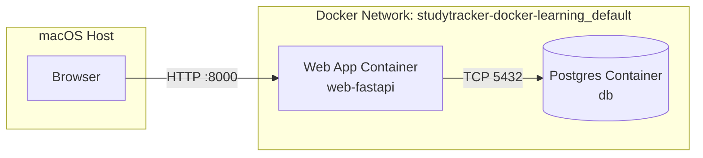
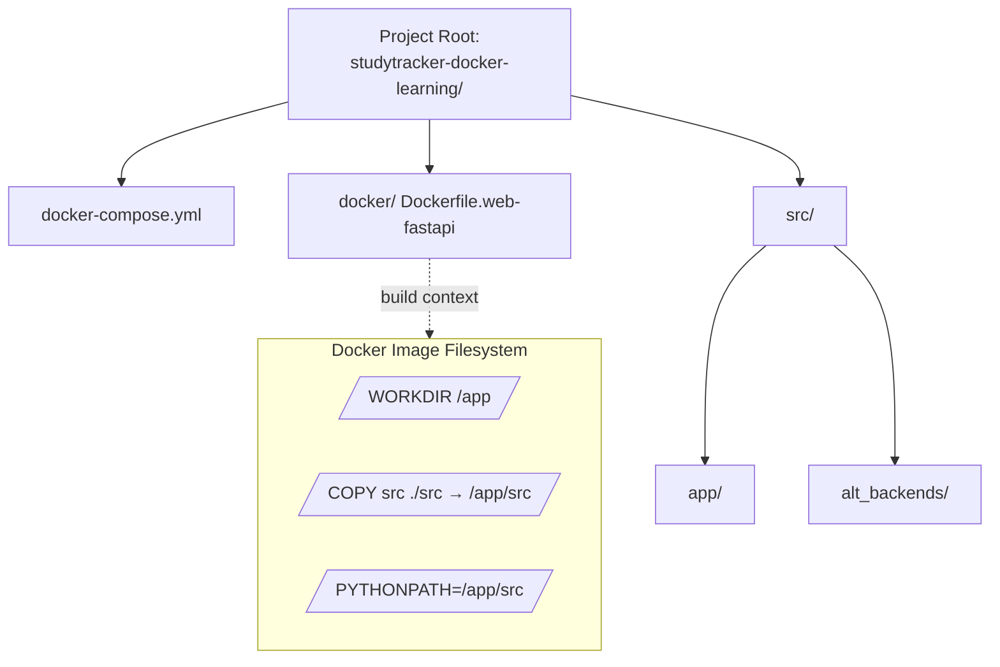

# 📘 Docker Fundamentals for StudyTracker

This page teaches the Docker concepts and file layout patterns used in the StudyTracker project, so the repo structure and commands feel predictable instead of magical.

---

## 1. Mental model: what Docker is doing





At a high level, Docker gives you:

- **Images** – immutable blueprints ("baked" filesystem + metadata).
- **Containers** – running instances of images, with their own processes and networking.
- **Dockerfiles** – recipes to build images.
- **docker-compose.yml** – orchestration file that says *which* containers to run and *how* they connect.

For StudyTracker:

- One image + container for **Postgres** (`db`).
- One image + container for the **FastAPI app** (`web-fastapi`).
- (Optionally) additional containers later for Flask/Express backends.

The goal is: `docker compose up` should give you a small, self-contained universe where `web-fastapi` can talk to `db` on a private Docker network, and you can talk to `web-fastapi` from your browser.

---

## 2. Repository layout and where Docker looks

Canonical StudyTracker layout:

```
studytracker-docker-learning/
├─ docker-compose.yml        # Orchestration for local dev
├─ docker/
│  └─ Dockerfile.web-fastapi # Build recipe for web-fastapi
├─ src/
│  ├─ app/
│  │  ├─ __init__.py
│  │  ├─ [main.py](http://main.py)              # FastAPI entrypoint
│  │  ├─ [database.py](http://database.py)          # DB engine + session helpers
│  │  ├─ [models.py](http://models.py)            # SQLAlchemy models (Topic, Session)
│  │  └─ [schemas.py](http://schemas.py)           # Pydantic schemas + error envelope
│  └─ alt_backends/
│     ├─ flask_app/
│     │  └─ [main.py](http://main.py)           # Flask implementation
│     └─ express_app/
│        └─ index.js          # Express implementation
├─ tests/
│  ├─ test_[healthz.py](http://healthz.py)
│  └─ test_[topics.py](http://topics.py)
├─ .github/
│  └─ workflows/
│     └─ ci.yml               # CI pipeline
├─ .env.example               # Template for local env
├─ [README.md](http://README.md)
├─ LICENSE
├─ [CONTRIBUTING.md](http://CONTRIBUTING.md)
├─ CODE_OF_[CONDUCT.md](http://CONDUCT.md)
├─ [SECURITY.md](http://SECURITY.md)
└─ pyproject.toml
```

**Key idea:** all Docker paths in config files are **relative to the file they’re in**.

- In `docker-compose.yml` at the repo root:
    - `dockerfile: docker/Dockerfile.web-fastapi` is resolved relative to the root.
- Inside `docker/Dockerfile.web-fastapi`:
    - `COPY src ./src` copies `src` **from the build context** into `/app/src` in the image.

Keeping `docker-compose.yml` at the root means all paths are expressed relative to the project root, which is easier to reason about.

---

## 3. Dockerfile: how we build the web-fastapi image

### 3.1 The StudyTracker Dockerfile

```docker
FROM python:3.12-slim

WORKDIR /app

ENV PYTHONDONTWRITEBYTECODE=1 \
    PYTHONUNBUFFERED=1 \
    PYTHONPATH=/app/src

RUN pip install --no-cache-dir fastapi uvicorn[standard]

COPY src ./src

CMD ["uvicorn", "app.main:app", "--host", "0.0.0.0", "--port", "8000"]
```

**Line by line:**

- `FROM python:3.12-slim`
    - Base image: Debian + Python 3.12 runtime.
- `WORKDIR /app`
    - Sets the working directory for subsequent commands and for the container at runtime.
- `ENV ...`
    - `PYTHONDONTWRITEBYTECODE=1`: avoid `.pyc` files.
    - `PYTHONUNBUFFERED=1`: logs flush immediately to stdout.
    - `PYTHONPATH=/app/src`: tells Python where to find the `app` package (`/app/src/app`).
- `RUN pip install ...`
    - Installs FastAPI and Uvicorn inside the image.
- `COPY src ./src`
    - From the *build context* (the project root, because `context: .` in compose) copy the `src` directory into the image at `/app/src`.
- `CMD [...]`
    - Default command for containers created from this image.
    - `app.main:app` is a **module path** (`app.main`) plus the `FastAPI` instance name (`app`).
    - `--host 0.0.0.0` means "listen on all interfaces" so Docker can map container port 8000 to host port 8000.

### 3.2 Common pitfalls

- **ModuleNotFoundError: No module named 'app'**
    - Caused when Python cannot see `app` on its import path.
    - Fixed by either:
        - Setting `PYTHONPATH=/app/src`, or
        - Changing `COPY` so that `app` ends up at `/app/app`, or
        - Changing the Uvicorn target to match the actual package path.
- **Forgetting `0.0.0.0`**
    - If you bind to `127.0.0.1` *inside* the container, Docker’s port mapping may not expose it properly on the host.

---

## 4. docker-compose.yml: wiring services together

### 4.1 StudyTracker compose file at repo root

```yaml
services:
  db:
    image: postgres:16
    environment:
      POSTGRES_DB: studytracker
      POSTGRES_USER: studytracker
      POSTGRES_PASSWORD: studytracker
    ports:
      - "5432:5432"
    volumes:
      - db-data:/var/lib/postgresql/data

  web-fastapi:
    build:
      context: .
      dockerfile: docker/Dockerfile.web-fastapi
    env_file:
      - .env
    depends_on:
      - db
    ports:
      - "8000:8000"

volumes:
  db-data:
```

**Important options:**

- `services.db.image`
    - Use the official `postgres:16` image from Docker Hub.
- `services.db.environment`
    - Configure the DB name/user/password that Postgres creates on first run.
    - These must match what your app uses in `DATABASE_URL`.
- `services.db.ports: "5432:5432"`
    - Exposes Postgres on your host at [`localhost:5432`](http://localhost:5432) (useful for psql or GUI tools).
- [`services.web-fastapi.build](http://services.web-fastapi.build).context: .`
    - Build context is the project root; everything under it is available to the Dockerfile’s `COPY` instructions.
- [`services.web-fastapi.build](http://services.web-fastapi.build).dockerfile: docker/Dockerfile.web-fastapi`
    - Path to the Dockerfile, relative to the build context.
- `services.web-fastapi.env_file: .env`
    - Load environment variables from the `.env` file into the container.
- `services.web-fastapi.depends_on: db`
    - Ensures Docker starts `db` before `web-fastapi` (does **not** guarantee readiness, just ordering).
- `services.web-fastapi.ports: "8000:8000"`
    - Map container port 8000 to host port 8000 → [`http://localhost:8000/healthz`](http://localhost:8000/healthz).

### 4.2 The `version` field warning

Older Compose files used a `version: "3.9"` or similar at the top. Modern `docker compose` treats this as obsolete and ignores it. You can safely remove `version:` in new configs.

---

## 5. Environment files and `DATABASE_URL`

We use a `.env` file so secrets and environment-specific values aren’t hardcoded into the compose file or Dockerfile.

### 5.1 .env.example

```
# Application
APP_ENV=local
APP_DEBUG=true
APP_PORT=8000

# Database
DATABASE_URL=postgresql+psycopg2://studytracker:studytracker@db:5432/studytracker
```

Workflow:

1. Copy `.env.example` → `.env`.
2. Optionally adjust values per machine or environment.
3. Compose loads `.env` for `web-fastapi` because of `env_file: - .env`.

Inside the container, `DATABASE_URL` is then available to your code (for example in `app/[database.py](http://database.py)`).

---

## 6. Networking: how containers talk vs. how you talk to them

Docker creates an internal network for the compose project, e.g. `studytracker-docker-learning_default`.

- Containers talk to **each other** using **service names**:
    - App connects to DB at host `db` and port `5432` because the service is named `db`.
- You talk to containers from your host using **published ports**:
    - `web-fastapi` → [`http://localhost:8000/healthz`](http://localhost:8000/healthz).
    - `db` → [`localhost:5432`](http://localhost:5432) for psql.

The internal hostnames (`db`, `web-fastapi`) are not visible from your browser; they exist only inside Docker’s network.

---

## 7. Typical lifecycle commands

From the project root (`studytracker-docker-learning/`):

- **Build + run web + db:**
    
    ```bash
    docker compose up --build web-fastapi db
    ```
    
- **Rebuild after code/Dockerfile changes:**
    
    ```bash
    docker compose build web-fastapi
    docker compose up web-fastapi db
    ```
    
- **Stop containers (but keep network/volumes):**
    
    ```bash
    docker compose stop
    ```
    
- **Stop and remove containers + network (keep volumes):**
    
    ```bash
    docker compose down
    ```
    
- **Stop and remove everything including volumes (fresh DB):**
    
    ```bash
    docker compose down -v
    ```
    

---

## 8. Debugging patterns

Common issues and how to reason about them:

1. **Browser can’t connect to [`localhost:8000`](http://localhost:8000)**
    - Check if `web-fastapi` is running:
        
        ```bash
        docker compose ps
        ```
        
    - Confirm `ports: "8000:8000"` is set.
    - Check container logs:
        
        ```bash
        docker compose logs web-fastapi
        ```
        
2. **`ModuleNotFoundError: No module named 'app'`**
    - Confirm your layout:
        
        ```
        src/app/[main.py](http://main.py)
        ```
        
    - Ensure either:
        - `PYTHONPATH=/app/src`, or
        - `COPY src/app ./app` in the Dockerfile, or
        - Update Uvicorn target (`uvicorn [src.app](http://src.app).main:app`, etc.).
3. **Database connection errors**
    - Confirm `DATABASE_URL` inside the container references `db:5432` (service name, not [`localhost`](http://localhost)).
    - Confirm `db` service is running and healthy (`docker compose logs db`).

---

## 9. How this connects back to StudyTracker

Everything in the Greenfield Docker Learning project is built on these rules:

- **Single source of truth for structure:**
    - Repo layout defined at the project root.
    - Dockerfile paths and compose paths always relative to that layout.
- **Explicit boundaries:**
    - App container knows how to talk to DB via `DATABASE_URL`.
    - Browser knows how to talk to app via published ports on [`localhost`](http://localhost).
- **Reproducibility:**
    - Anyone with Docker can run `docker compose up --build web-fastapi db` and get the same topology.

Once this mental model is solid, adding more services (Flask, Express, an MCP gateway, etc.) is mostly copy‑paste with small changes to Dockerfiles and compose services rather than reinventing the wheel each time.

---

## 10. Inline bash scripts for common workflows

### 10.1 Deploy (fresh start)

```bash
#!/usr/bin/env bash
set -euo pipefail

# 1) Go to the repo root
cd "${HOME}/Documents/GitHub/studytracker-docker-learning"

# 2) Make sure env file exists
if [ ! -f .env ]; then
  echo "Creating .env from .env.example..."
  cp .env.example .env
fi

# 3) Build and start app + database
docker compose up --build web-fastapi db
```

### 10.2 Rebuild after code or Dockerfile changes

```bash
#!/usr/bin/env bash
set -euo pipefail

cd "${HOME}/Documents/GitHub/studytracker-docker-learning"

# 1) Rebuild the web-fastapi image
docker compose build web-fastapi

# 2) Restart app + database (reuses existing volume data)
docker compose up web-fastapi db
```

### 10.3 Destroy environment (including database data)

```bash
#!/usr/bin/env bash
set -euo pipefail

cd "${HOME}/Documents/GitHub/studytracker-docker-learning"

# 1) Stop containers and remove network + volumes
#    WARNING: this deletes the Postgres data volume (fresh DB next run)
docker compose down -v
```

### 10.4 Refresh (restart without rebuild or data loss)

```bash
#!/usr/bin/env bash
set -euo pipefail

cd "${HOME}/Documents/GitHub/studytracker-docker-learning"

# 1) Stop running containers (network and volumes remain)
docker compose stop

# 2) Start containers again with existing images and volumes
docker compose up web-fastapi db
```

---

## 11. Useful container-level commands (CLI cheat sheet)

All commands assume you are in the repo root (`studytracker-docker-learning/`).

```bash
# Show status of all services in this compose project
docker compose ps

# Tail logs from the web-fastapi service
docker compose logs -f web-fastapi

# Tail logs from the db service
docker compose logs -f db

# Open a shell inside the running web-fastapi container
# (useful for inspecting environment, Python path, etc.)
docker compose exec web-fastapi /bin/bash

# Run a one-off command inside web-fastapi
# Example: run tests from inside the container
docker compose run --rm web-fastapi pytest -v

# Connect to Postgres from inside the db container
# (psql will already be installed)
docker compose exec db psql \
  -U studytracker \
  -d studytracker
```

---

## 12. Scenario map (when to use which script)

```jsx
Scenario                                      → Script / Command
--------------------------------------------  ------------------------------
First-time setup / new machine                → Deploy (10.1)
Normal dev after small code changes           → Rebuild (10.2)
Service seems stuck; want clean restart       → Refresh (10.4)
DB schema or data is badly out of sync        → Destroy (10.3) then Deploy
Inspect logs for troubleshooting              → docker compose logs -f ...
Inspect container internals (shell)           → docker compose exec ...
Run tests in a clean, ephemeral web container → docker compose run --rm ...

```

---

## 13. Docker Titanium 10+ validation checklist (StudyTracker)

Use this checklist when validating the Docker slice of StudyTracker on a clean machine.

- [ ]  **Repo layout matches spec**
    - `studytracker-docker-learning/` contains `docker-compose.yml`, `docker/`, `src/app/`, `tests/`, `.github/workflows/ci.yml`, and standard docs (README, LICENSE, etc.).
- [ ]  **Environment wiring works**
    - `.env` created from `.env.example`.
    - `DATABASE_URL` points to `postgresql+psycopg2://studytracker:studytracker@db:5432/studytracker`.
- [ ]  **Happy-path deploy works**
    - `Deploy (10.1)` runs without error on a clean clone.
    - [`http://localhost:8000/healthz`](http://localhost:8000/healthz) returns a 200 JSON response.
- [ ]  **Rebuild path works**
    - After a small code or Dockerfile change, `Rebuild (10.2)` completes and the app responds correctly.
- [ ]  **Refresh path works**
    - `Refresh (10.4)` stops and restarts containers without losing DB data.
- [ ]  **Destroy + clean redeploy works**
    - `Destroy (10.3)` followed by `Deploy (10.1)` produces a clean DB and a working app.
- [ ]  **Debugging tools verified**
    - `docker compose ps`, `logs -f web-fastapi`, and `exec web-fastapi /bin/bash` all work as documented.
    - `docker compose exec db psql -U studytracker -d studytracker` connects successfully.
- [ ]  **CI integration confirmed**
    - GitHub Actions CI (root README / CI page) runs lint + tests successfully on at least one branch using this Docker layout.

```

```